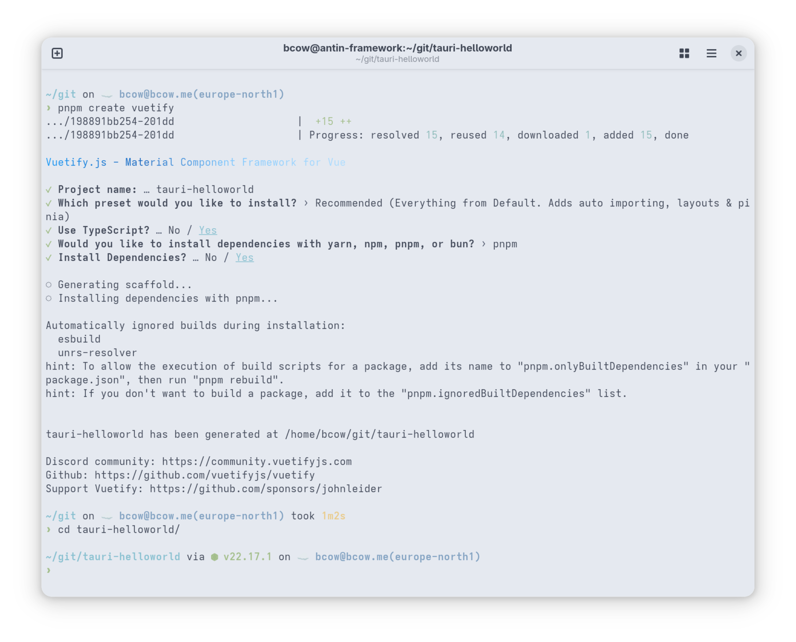
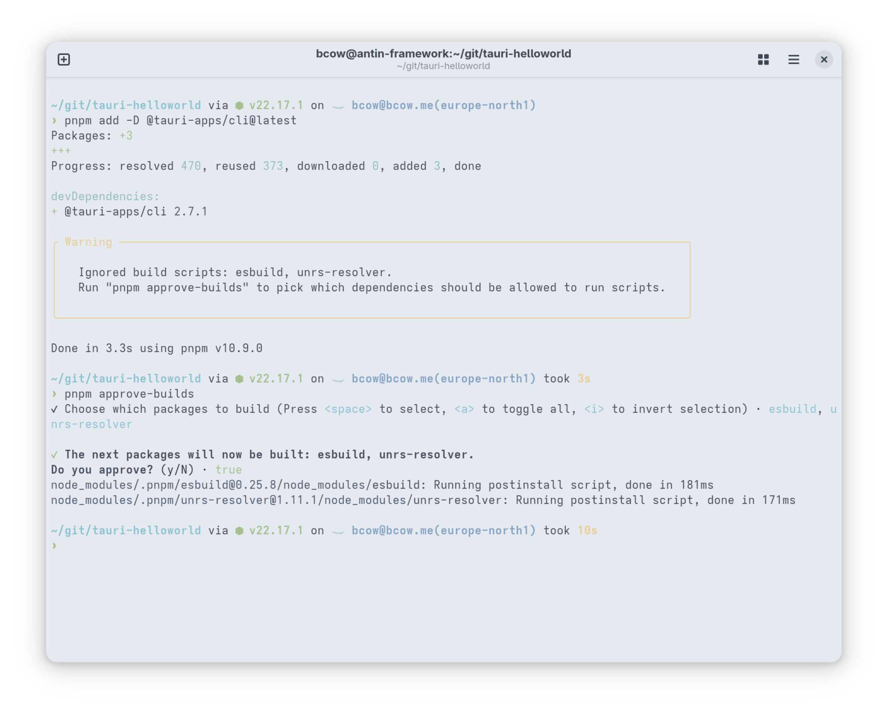
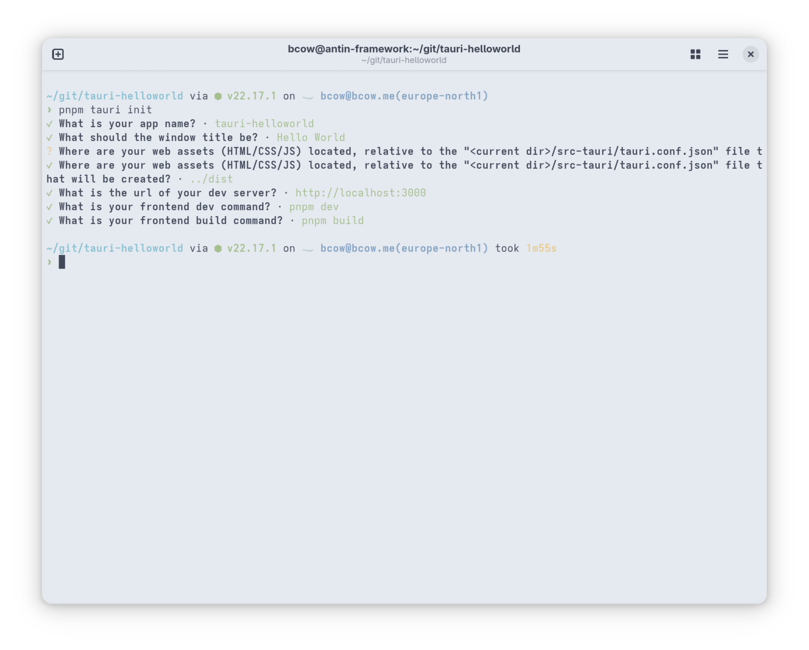
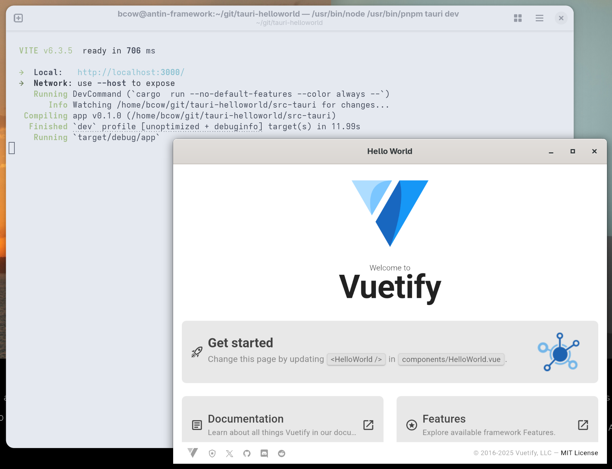

+++
title = "Tauri and Vuetify want to say Hello, World!"
weight = 0

[taxonomies]
tags = ["rust", "vue", "vuetify", "typescript", "tauri", "Android"]
+++

## An example application

Tauri's getting started guide and intuitive tooling assist one to quickly create a new application from scratch, but that uses Vue only and does not incorporate Vuetify. It is ofcourse possible manually to add the dependency, initialize and take it into use, but it still requires writing lots of boiler plate in case we want to utilize Pinia store, automated imports, automated routing and etc in our application that are not part of Vuetify itself, but which I love on its default template.

What does provide these things from out of the box? You guessed it, Vuetifys own tooling which we will utilize here via `pnpm`, but you are free to use `npm`, `yarn` or any another pleathora of tools available for this purpose in the JavaScript world.

One of the reasons why I hate modern frontend development is the distracting development tooling and the state of the NPM ecosystem in general, but I digress. More on the reasoning in the [first part of this series](@/posts/2025-08-10_tauri_and_vuetify.md).

### A new Vuetify application

After initializing the Vuetify we need to add Tauri to the dependencies and as a part of the build process. But first, before we can do that, we need to have the Tauri utilities as well as the operating system and other development libraries installed as detailed in the Tauri's quickstart guide. Remind you that you need to have of course [Rust toolchain and Cargo](https://rustup.rs/) installed first too.



### Add Tauri to the project

And lets add Tauri to the build process while were at it and initialize the Rust application side of things.





Some parts of the Tauri tooling do require some additional configuration here, there and in the Vite configuration which are not strictly necessary at this stage.

Also things like the `@tauri-apps/api` npm library is not added to the your `package.json`, but these can also be solved later when necessary.

Additionally it is recommended to check the recommendations for other steps in the Tauri's quick start guide that explains these changes in greater detail. But even without these modifications an "Hello, World" example can be achieved.

### Launch the Hello, World

Now we should be ready to see the foundations of both Tauri and Vuetify in action by initiating a debug build and preview of our software with:

```sh
pnpm tauri dev
```



There we have it; a Rust created OS native window with Vue application running inside of a platform spesific webview. All decorated with Vuetify eye-candy and all the routing goodness provided by TypeScript happening in the background. Granted there is very little of that in display here, yet, as there are only few boxes and images present. But, imagine utilizing all of the fabulous components available from the Vuetify project and opening new Tauri windows to displays different pages behind your router for example.

#### One more neat trick, Android

If you have the Android SDK and emulator setup properly first you can actually run `pnpm tauri android`, and your Tauri application will start as an Android app inside the emulator without no need for any extra code or configuration. That is a neat trick if you should ever need it, for reasons.

### Conclusion

We have successfully laid the groundwork, combining the light, secure, and performant backend of Tauri with Vue UI. With just a few changes, we have a native desktop application running, complete with hot-reloading for a smooth development experience. And the same would be true for Android as well if you would need that. This powerful combination gives us a solid foundation to build upon in the next part of this series. There we will create an interface to send a name from our Vue component to a Rust function and display the returned greeting, demonstrating the core functionality of signaling between Rust backend and TypeScript (Vuetify) frontend.
