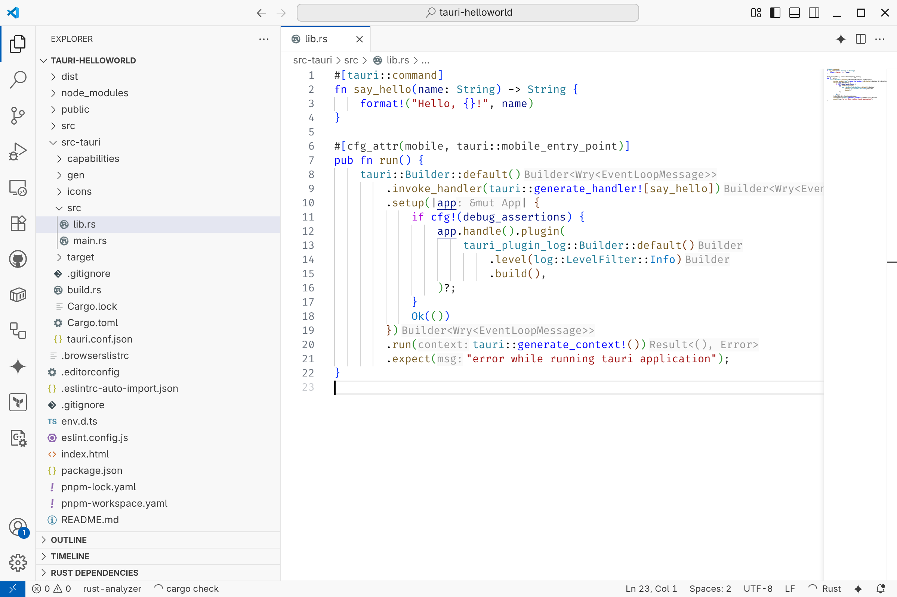

+++
title = "Tauri and Vuetify, signals between the two worlds"
weight = 0
draft = true

[taxonomies]
tags = ["rust", "vue", "vuetify", "typescript", "tauri"]
+++

### Invoking Rust from TypeScript

First we need to implement a function in Rust that we can call and then give it some additional Tauri boilerplate via a Rust derive macro. Also we need to define it in the Tauri application builder pattern to let Tauri itself know about its existence via the `.invoke_handler()` method.

To call our function we need to define in our TypeScript applications side

TODO: call function from Vue

### Signaling to TypeScript from Rust

TODO
